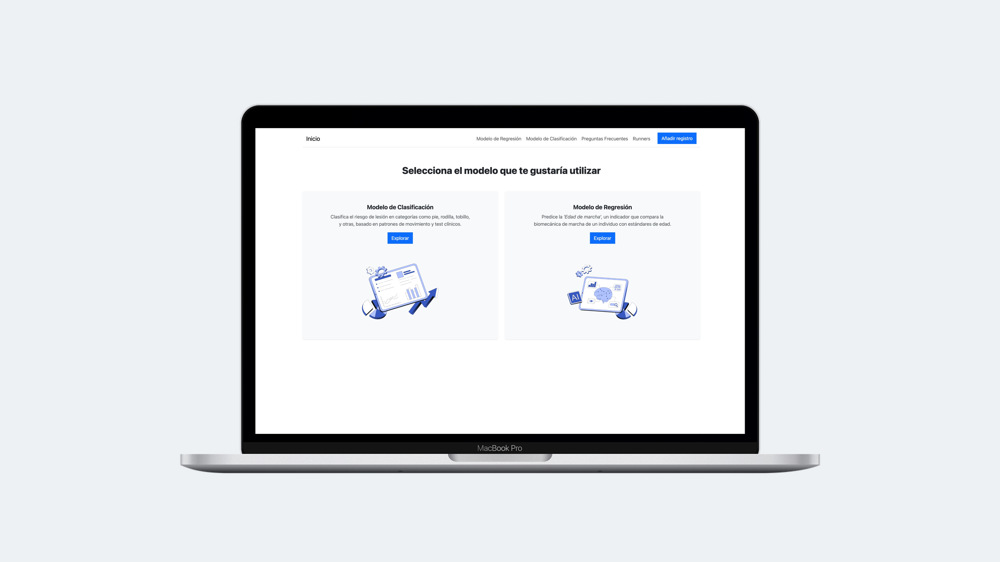
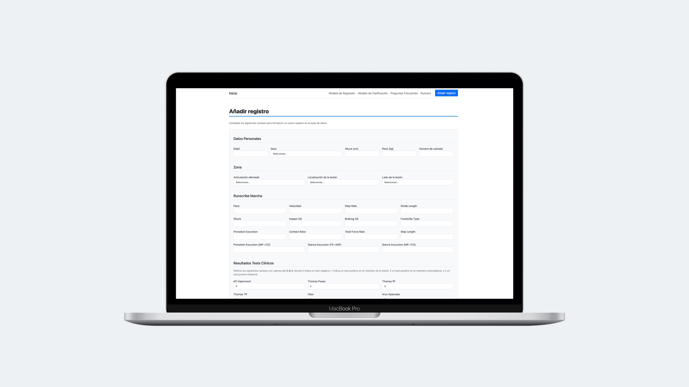
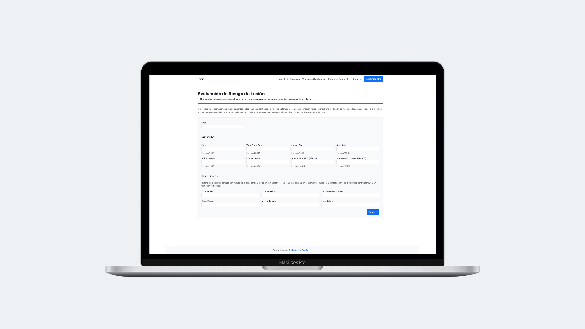
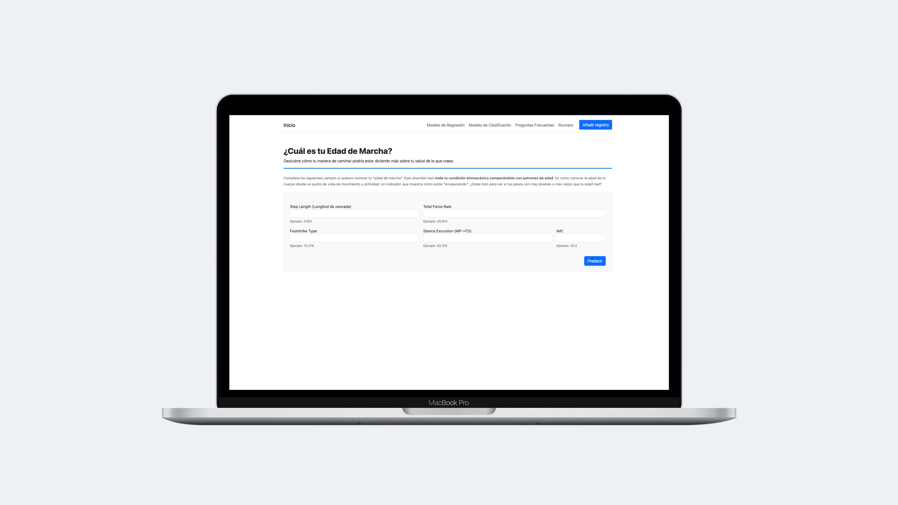

# Análisis Predictivo para el Riesgo de Lesiones Musculoesqueléticas

## Introducción

Este proyecto tiene como objetivo desarrollar un **sistema predictivo para evaluar el riesgo de lesiones musculoesqueléticas y determinar la edad de marcha en pacientes**. La solución integra técnicas avanzadas de minería de datos y aprendizaje automático, implementadas como una **aplicación web utilizando Flask y desplegada en Google Cloud Platform (GCP)** mediante App Engine. El proyecto analiza un conjunto de datos biomecánicos y clínicos para identificar patrones y factores de riesgo asociados con áreas o zonas de lesión.


## Metodología

El desarrollo de este proyecto se ha realizado siguiendo una metodología ágil basada en sprints, dividida en cinco etapas principales. Cada etapa se documenta detalladamente dentro de la carpeta `project/docs`. Las etapas incluyen:

1. **Definición del Proyecto y Configuración Inicial** *(Sprint 0)*
2. **Análisis Exploratorio Inicial de los Datos y ETL con PySpark** *(Sprint 1)*
3. **Preprocesamiento de los Datos y Desarrollo de Modelos Predictivos de ML** *(Sprint 2)*
4. **Definición de la Arquitectura Cloud y Despliegue de la Aplicación Web** *(Sprint 3)*
5. **Visualizaciones con Tableau y D3.js** *(Sprint 4)*
5. **Optimización, Documentación y Presentación del Proyecto** *(Sprint 5)*


## Estructura

La estructura del proyecto está organizada de la siguiente manera:

```plaintext
/proyecto
│
├── README.md           # Descripción general del proyecto
├── requirements.txt    # Dependencias de Python
├── app.py              # Archivo principal de la aplicación Flask
├── app.yaml            # Configuración para despliegue en Google Cloud
├── main.py             # Archivo principal para Google Cloud Functions
├── my_module.py        # Funciones utilizadas en main.py
├── wsgi.py
├── Dockerfile          # Configuración de Docker para despliegue
├── docker-compose.yml  # Configuración de Docker Compose
├── .gitignore          # Archivos y directorios a ignorar por git
├── .gcloudignore       # Archivos y directorios a ignorar por gcp
│
├── /myapp              # Directorio principal para la aplicación Flask
│   ├── __init__.py     # Inicialización de la aplicación Flask
│   ├── config.py       # Configuraciones de la aplicación
│   ├── database.py     # Definición de la tabla 'usuarios' de SQL Cloud
│   ├── extensions.py   # Importación de SQLAlchemy
│   ├── routes.py       # Definición de rutas/endpoints
│   ├── users.py        # Rutas/endpoints para añadir y ver registros de usuarios
│   ├── storage.py      # Funciones de almacenamiento (GCS)
│   ├── utils.py        # Utilidades y funciones auxiliares
│   ├── /templates      # Plantillas HTML para Flask
│   ├── /static         # Archivos estáticos (CSS, JS, imágenes)
│       ├── /css        # Contiene style.css
│       ├── /js         # Archivo 3d.js
│       ├── /images     # Recursos estáticos de la aplicación
│       └── /ico        # Archivos favicon de la aplicación
│
├── /models             # Modelos de machine learning usados en la App
│   ├── __init__.py
│   ├── classification_model.py  # Código para cargar y usar el modelo de Clasificación
│   ├── regression_model.py      # Código para cargar y usar el modelo de Regresión
│   ├── bagging_model.pkl        # Modelo de Clasificación
│   └── extraTrees_model.pkl     # Modelo de Regresión
│
├── /data               # Directorio para datos
│   ├── /raw            # Datos en bruto
│   └── /processed      # Datos procesados
│
├── /etl                # Scripts de ETL y procesamiento de datos
│   ├── ETL.ipynb
│   ├── spark_env       # Entorno y configuración de Spark
│   ├── elt-script.py   # Script principal de procesamiento de datos
│   └── elt.ipynb       # Jupyter Notebook del procesamiento inicial
│
├── /notebooks          # Jupyter Notebooks para análisis, exploración, procesamiento y modelado
│
├── /tests              # Pruebas unitarias y de integración
│   ├── __init__.py
│   ├── test_etl.py               # Pruebas para ETL
│   ├── test_flask_app.py         # Pruebas unitarias para la API
│   ├── test_cloud_functions.py   # Pruebas para Google Cloud Functions
│   └── test_routes.py            # Pruebas para las rutas de la app
│
├── /project                   # Documentación del proyecto
│   ├── /docs                  # Documentación dividida en Sprints
│   └── /investigacion-previa  # Recursos de la investigación inicial
│
├── /sql                 # Scripts SQL
└── /src
    ├── /models          # Todos los modelos guardados
    └── /utils           # Utilidades y funciones auxiliares
```

## Archivos Principales de la Aplicación

Los archivos principales de la aplicación Flask se encuentran en la carpeta `myapp`. Esta carpeta incluye configuraciones, definiciones de rutas, funciones de almacenamiento y otros recursos necesarios para el funcionamiento de la aplicación.

## Cómo Utilizar este Repositorio

Para utilizar este repositorio, puedes seguir estos pasos:

1. **Instalación de Dependencias:**
   - Ejecuta `pip install -r requirements.txt` para instalar todas las dependencias de Python necesarias.

2. **Configuración del Entorno:**
   - Asegúrate de tener configuradas las variables de entorno necesarias para la conexión a la base de datos y servicios de Google Cloud.

3. **Ejecución de la Aplicación Localmente:**
   - Ejecutar `python app.py` para iniciar la aplicación Flask en su entorno local.

4. **Despliegue en Google Cloud:**
   - Utilice `gcloud app deploy` para desplegar la aplicación en Google Cloud Platform.


## Screens App





