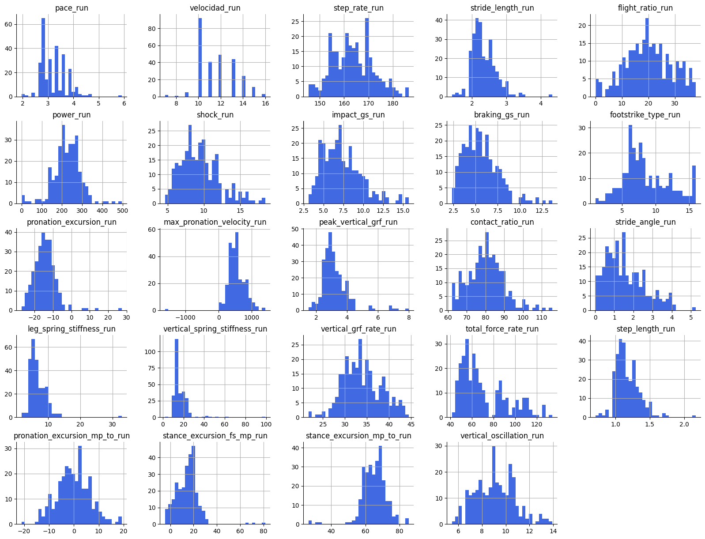
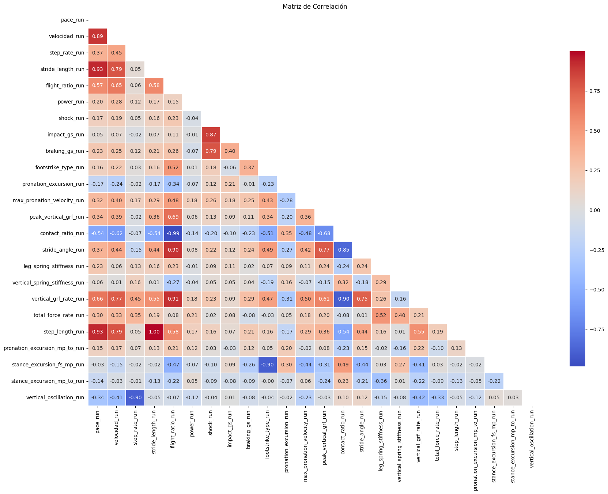
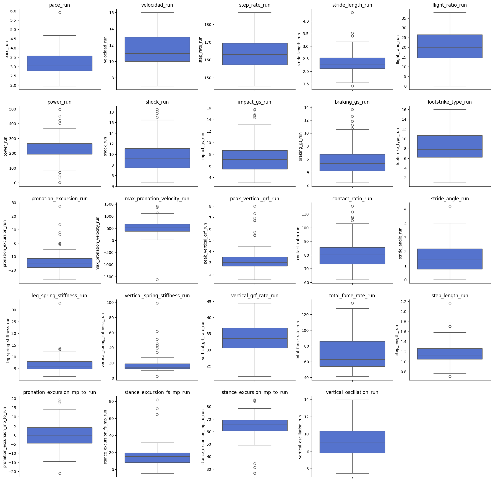

# Proyecto ETL y Análisis de Métricas de Carrera con Spark

## Descripción del Proyecto

Esta etapa se centra en la realización de un **proceso ETL (Extract, Transform, Load) y el cálculo de métricas** utilizando [Spark en Python](https://spark.apache.org/docs/latest/api/python/index.html). Los datos utilizados son registros de pacientes que incluyen métricas demográficas, biomecánicas y de pruebas clínicas. El objetivo principal es comprender mejor las características de los sujetos de estudio y proporcionar una base sólida para futuras investigaciones.

🔗 [Configuración del Entorno de Desarrollo para PySpark](./PySpark_Environment_Setup.md)

## Pasos Realizados

1. **Importación de Librerías y Preparación del Entorno**
   - Se importaron las librerías necesarias como [PySpark](https://spark.apache.org/docs/latest/api/python/index.html), [pandas](https://pandas.pydata.org/), [numpy](https://numpy.org/), [matplotlib](https://matplotlib.org/), y [seaborn](https://seaborn.pydata.org/).
   - Se configuró la sesión de Spark con las variables de entorno adecuadas.

2. **Carga de Datos - `Extract`**
   - Los datos fueron cargados desde un [archivo CSV](../../../data/processed/dataset_corredores.csv) utilizando PySpark.
   - Se revisaron y limpiaron los nombres de las columnas.

3. **Análisis Exploratorio de Datos (EDA)**
   - Se contaron los registros del dataset.
   - Se mostró el esquema del DataFrame para entender los tipos de datos.
   - Se seleccionaron las columnas de interés relacionadas con sujetos deportistas.
   - Se analizaron los valores faltantes y únicos de las columnas seleccionadas.

4. **Transformación de Datos - `Transform`**
   - Se estandarizaron las columnas de texto y se agruparon en categorías coherentes.
   - Se eliminaron espacios en blanco en las columnas de texto.
   - Se reemplazaron puntos por comas en columnas numéricas donde era necesario.
   - Se imputaron valores faltantes utilizando la media y la moda, según el caso.
   - Se convirtieron columnas a tipos numéricos adecuados.

5. **Eliminación de Registros Inadecuados**
   - Se eliminaron registros con valores nulos o faltantes.

6. **Cálculo de Métricas**
   - Se calcularon métricas de edad, altura y peso.
   - Se calculó el promedio de índice de masa corporal (IMC) de los sujetos de estudio.
   - Se calcularon estadísticas descriptivas para las columnas biomecánicas de carrera.

7. **Verificación Final**
   - Se comprobó la ausencia de valores faltantes tras las transformaciones.

8. **Visualización de Datos**
   - Se generaron histogramas, matrices de correlación y boxplots para las métricas de carrera.
   - Se analizaron los outliers.

9. **Guardar Resultados - `Load`**
   - Los resultados se guardaron para futuras referencias e investigaciones.

## Análisis de Resultados

### Histogramas y Boxplots

Se generaron histogramas y boxplots para cada métrica de carrera, lo que permitió identificar la distribución de los datos y detectar posibles outliers. A continuación, se presentan algunos resultados de ejemplo:

- **Pace Run**
  - Promedio: 3.21
  - Desviación estándar: 0.51
  - Mínimo: 1.96
  - Máximo: 5.91

- **Velocidad Run**
  - Promedio: 11.57
  - Desviación estándar: 1.67
  - Mínimo: 7.0
  - Máximo: 16.0

- **Step Rate Run**
  - Promedio: 163.58
  - Desviación estándar: 8.36
  - Mínimo: 145.38
  - Máximo: 186.58

### Matriz de Correlación

La matriz de correlación reveló relaciones significativas entre varias métricas. A continuación se destacan algunas de las correlaciones altas entre características:

- **Contact Ratio Run y Stride Length Run (-0.99)**: a mayor longitud de zancada, menor es el tiempo de contacto.
- **Stride Angle Run y Stride Length Run (0.97)**: el ángulo de la zancada está estrechamente relacionado con la longitud de la zancada.
- **Pace Run y Stride Length Run (0.93)**: una mayor longitud de zancada se asocia con un menor tiempo por kilómetro (ritmo más rápido).
- **Pace Run y Step Length Run (0.93)**: una mayor longitud de paso se asocia con un menor tiempo por kilómetro.
- **Vertical GRF Rate Run y Flight Ratio Run (0.91)**: una mayor tasa de fuerza de reacción del suelo está asociada con un mayor tiempo de vuelo.
- **Stride Angle Run y Flight Ratio Run (0.90)**: un mayor ángulo de zancada se asocia con un mayor tiempo de vuelo.
- **Vertical GRF Rate Run y Contact Ratio Run (-0.90)**: una mayor tasa de fuerza de reacción del suelo se asocia con un menor tiempo de contacto.
- **Vertical Oscillation Run y Step Rate Run (-0.90)**: una mayor oscilación vertical se asocia con una menor frecuencia de pasos.
- **Stance Excursion (Fs->MP) Run y Footstrike Type Run (0.90)**: una mayor excursión del pie está asociada con un tipo de golpe de pie diferente.
- **Pace Run y Velocidad Run (0.89)**: a mayor velocidad de carrera, menor es el tiempo por kilómetro (pace).
- **Shock Run y Impact GS Run (0.87)**: una mayor fuerza de choque se asocia con un mayor impacto.
- **Stride Angle Run y Contact Ratio Run (-0.85)**: un mayor ángulo de zancada se asocia con un menor tiempo de contacto.
- **Stride Length Run y Velocidad Run (0.79)**: los corredores con zancadas más largas tienden a correr más rápido.
- **Step Length Run y Velocidad Run (0.79)**: una mayor longitud de paso se asocia con una mayor velocidad de carrera.

Estas correlaciones proporcionan información valiosa sobre cómo diferentes aspectos de la biomecánica de carrera están interrelacionados, ayudando a identificar características clave que afectan el rendimiento de los corredores.

### Outliers

Se identificaron outliers en varias métricas, como `power_run`, `peak_vertical_grf_run`, `impact_gs_run` o `braking_gs_run`. Estos outliers podrían ser sujetos con características biomecánicas excepcionales o errores en la recogida de datos.

## ETL con Spark

Se ha añadido un script de ETL ([etl-script.py](../../../etl/elt-script.py)) que se desarrolló inicialmente en un cuaderno de Jupyter ([elt.ipynb](../../../etl/elt.ipynb)). El script se encuentra en el directorio `/etl` junto con el cuaderno original.

## Docker

- **Actualización de Dockerfile**: El Dockerfile se ha actualizado para incluir las dependencias necesarias para ejecutar el script de ETL con Spark.
- **Actualización de `docker-compose.yml`**: El archivo [docker-compose.yml](../../../docker-compose.yml) se ha configurado para definir servicios que utilicen PySpark y Flask.

## Conclusión

En esta primera fase del proyecto, **no se trabajó con los datos de RunScribe de Carrera para la etapa de modelado** debido a la presencia de numerosos **valores faltantes**. Sin embargo, se utilizaron estos datos para cumplir con los requisitos de ETL y obtener una visión más detallada sobre los sujetos de estudio. Este análisis preliminar resalta la necesidad de **establecer un protocolo y estandarización en la recogida de datos** para evitar un procesamiento tan complejo en el futuro. Es importante implementar métodos consistentes y precisos para la recolección de datos, minimizando errores y valores faltantes, lo que permitirá obtener resultados más precisos y útiles en investigaciones futuras.

## Visualizaciones

Se adjuntan las visualizaciones generadas durante el análisis:

