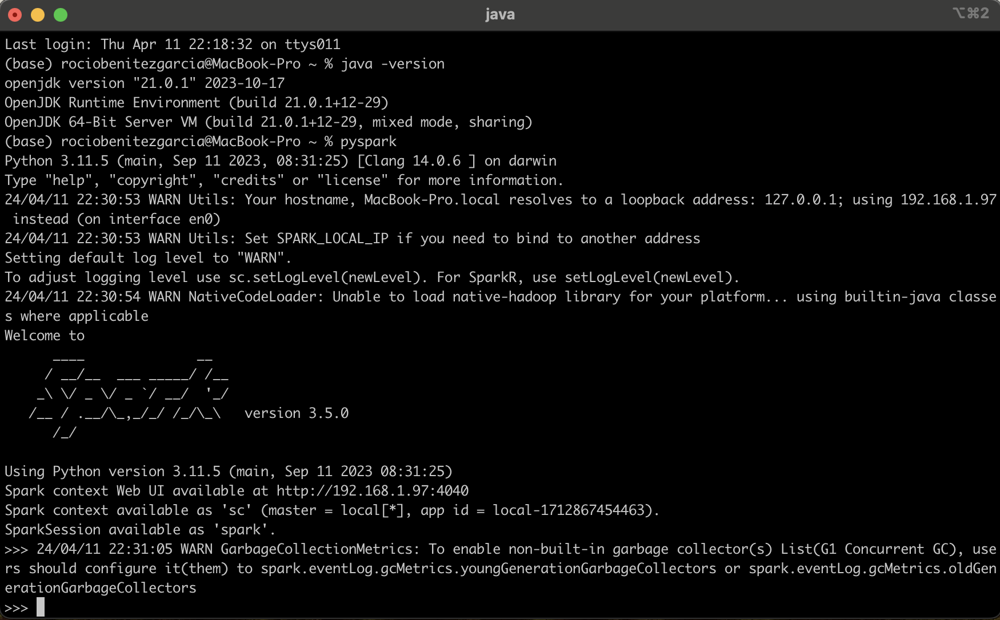
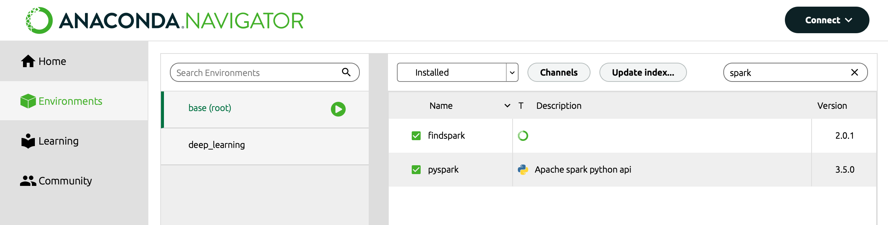

# Configuración del Entorno de Desarrollo para PySpark

## Objetivo

Este documento proporciona una guía paso a paso para verificar la instalación y configuración de Java, PySpark y Spark en un entorno macOS, utilizando Anaconda como gestor de paquetes y entornos.


## Configuración de Java

### Verificación

Para verificar que Java está instalado y determinar su versión, ejecuta el siguiente comando en la terminal:

```sh
java -version
```

La salida esperada debe ser similar a:

```
openjdk version "21.0.1" 2023-10-17
OpenJDK Runtime Environment (build 21.0.1+12-29)
OpenJDK 64-Bit Server VM (build 21.0.1+12-29, mixed mode, sharing)
```

Esta salida confirma que Java está instalado y listo para ser usado.

### Instalación

Si Java no está instalado, puedes instalar OpenJDK usando Homebrew:

```sh
brew install openjdk
```

Asegúrate de seguir las instrucciones de Homebrew para configurar las variables de entorno necesarias.


## Configuración de PySpark

### Instalación

Instala PySpark usando Anaconda con el siguiente comando:

```sh
conda install -c conda-forge pyspark
```

### Verificación

Verifica la instalación iniciando el shell interactivo de PySpark:

```sh
pyspark
```

Si el shell interactivo se inicia correctamente, significa que PySpark está instalado correctamente.

### Advertencias

Es posible que veas advertencias sobre la incapacidad de cargar la biblioteca nativa de Hadoop y sobre la configuración del recolector de basura. Estas advertencias generalmente no afectan el uso básico de PySpark y pueden ser ignoradas si no estás utilizando Hadoop. Para optimizar el rendimiento, puedes ajustar la configuración del recolector de basura según sea necesario.




## Configuración de Spark

### Instalación

Instala Spark usando Anaconda con el siguiente comando:

```sh
conda install -c conda-forge spark
```

### Configuración

No se requiere configuración adicional de la variable `SPARK_HOME` porque Anaconda gestiona automáticamente las rutas necesarias.

### Verificación de la Instalación de Spark

Para verificar que Spark está instalado correctamente, puedes buscar archivos relacionados con Spark:

```sh
find ~ -name "spark-*"
```

Los resultados deben mostrar la presencia de Spark en varios directorios dentro de la distribución de Anaconda, confirmando que la instalación se realizó correctamente.




## Resumen

El entorno para PySpark y Spark está correctamente configurado para el desarrollo y ejecución de aplicaciones de Spark en un entorno macOS, con Java como requisito previo ya instalado y funcional. Con PySpark y Spark gestionados a través de Anaconda, se asegura una configuración eficiente y sin complicaciones.