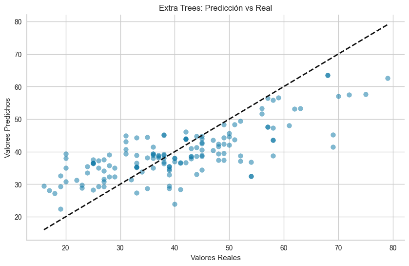

# Fase de Modelado Predictivo

## Introducción

En esta fase del proyecto, nos enfocamos en la construcción de **modelos predictivos de clasificación y regresión** utilizando datos biomecánicos y clínicos. Se evaluaron y optimizaron múltiples algoritmos de **machine learning** para desarrollar modelos precisos y robustos. Se emplearon herramientas como [PyCaret](https://pycaret.org/) para la exploración inicial de modelos y ajustes de hiperparámetros, con el fin de seleccionar y optimizar los modelos más efectivos.

## Modelado de Clasificación

El objetivo del modelo de clasificación es **predecir la articulación afectada** basándose en diversas características biomecánicas y clínicas.

### Configuración del Entorno y Librerías

Se configuró un entorno controlado y se instalaron bibliotecas esenciales como `sklearn`, `matplotlib` y `logging` para apoyar el proceso de modelado y visualización.

### Proceso de Modelado

1. **Carga y Preprocesamiento de Datos**
   - Se cargaron los datos desde un archivo CSV y se preprocesaron para asegurar su adecuación para el modelado.
   - Se seleccionaron las características (features) y la variable objetivo (target).

2. **División del Conjunto de Datos**
   - Los datos se dividieron en conjuntos de entrenamiento y prueba utilizando una división estratificada para mantener la proporción de clases.

3. **Manejo del Desbalanceo de Clases**
   - Para abordar el desbalanceo de clases, se agruparon categorías menos frecuentes en una nueva categoría llamada "otro". Esto permitió una distribución más equilibrada de las clases.

   ```python
   # Agrupación de categorías menos frecuentes en una nueva categoría llamada 'otro'
   df['articulacion'] = df['articulacion'].replace(['pierna', 'cadera', 'espalda', 'sin afectacion', 'muslo', 'complejo'], 'otro')
   print(f"Número de categorías únicas en 'articulacion' después de la transformación: {df['articulacion'].nunique()}")
   ```

4. **Codificación de Etiquetas**
   - Las etiquetas de la variable objetivo se codificaron numéricamente para ser utilizadas en los algoritmos de machine learning.

5. **Entrenamiento y Optimización del Modelo**
   - Se utilizaron varias técnicas y algoritmos para entrenar los modelos, destacando el uso de `Gradient Boosting Classifier` y `BaggingClassifier` con `RandomForestClassifier` como estimador base.
   - Se empleó `GridSearchCV` para optimizar los hiperparámetros, como la profundidad máxima del estimador base.

6. **Evaluación del Modelo**
   - Se evaluó el rendimiento del modelo en el conjunto de prueba y se generaron gráficos para visualizar la relación entre la profundidad máxima del estimador y la precisión balanceada.

7. **Guardado del Modelo**
   - El modelo entrenado se guardó utilizando `pickle` para su uso futuro.

### Resultados y Conclusiones

- **Mejor Desempeño General**: El modelo `Bagging Classifier` presentó el mejor desempeño, con una **precisión de prueba de 0.451**.
- **Manejo del Desbalanceo de Clases**: La agrupación de categorías menos frecuentes mejoró significativamente la capacidad del modelo para manejar el desbalanceo de clases.
- **Importancia de la Selección de Características**: Características como `total force rate_walk`, `pace_walk`, y `stride length_walk` fueron cruciales para la precisión del modelo.



El [script final del modelo de clasificación](../../../notebooks/modeling_classifier_script.py) incluye todo el proceso desde la carga de datos hasta el guardado del modelo optimizado.

## Modelado de Regresión

El objetivo del modelo de regresión es **predecir la edad del paciente** utilizando características biomecánicas y clínicas.

### Configuración del Entorno y Librerías

Se configuró un entorno controlado e instalaciones de bibliotecas necesarias para el modelado y la evaluación de regresión.

### Proceso de Modelado

1. **Carga y Preparación de Datos**
   - Se cargaron los datos desde un archivo CSV y se seleccionaron las características relevantes y la variable objetivo.

2. **División del Conjunto de Datos**
   - Los datos se dividieron en conjuntos de entrenamiento y prueba, y se escalaron las características para optimizar el rendimiento de los modelos.

3. **Entrenamiento de Modelos Individuales**
   - Se entrenaron diversos modelos de regresión, como `RandomForestRegressor`, `GradientBoostingRegressor` y `ExtraTreesRegressor`.

4. **Configuración y Evaluación de Stacking Regressor**
   - Se configuró un `StackingRegressor` utilizando los modelos individuales entrenados y se evaluaron diferentes estimadores finales.

### Resultados y Conclusiones

- **Mejores Modelos**: El `Extra Trees Regressor` y los modelos de ensamblaje (`Stacking` y `Voting Regressor`) lograron el mejor equilibrio entre las métricas evaluadas.
- **Importancia de la Selección de Características**: Características como **imc, stance excursion (mp->to)_walk, y peso** fueron clave en las predicciones.
- **Efecto del Escalado y Regularización**: Modelos con técnicas de regularización mostraron un rendimiento estable, destacando la importancia del escalado.


El [script final del modelo de regresión](../../../notebooks/modeling_age_prediction_script.py) proporciona un flujo de trabajo estructurado para el entrenamiento y evaluación de múltiples modelos.

## Desafíos y Retos

Durante esta fase enfrentamos varios desafíos:
- **Desequilibrio de Clases**: Agrupamos categorías para manejar el desbalanceo de clases.
- **Imputación de Valores Faltantes**: Implementamos estrategias avanzadas de imputación.
- **Normalización y Estandarización de Datos**: Reducimos la variabilidad en los datos.
- **Alta Dimensionalidad**: Seleccionamos características relevantes para evitar el sobreajuste.
- **Manejo de Outliers**: Evaluamos el impacto de los outliers en el rendimiento del modelo.

## Conclusiones y Futuras Mejoras

Este proyecto destacó la importancia de una evaluación exhaustiva y comparativa de múltiples modelos predictivos. Las técnicas de ensamblaje y la adecuada selección y análisis de características mejoraron significativamente el rendimiento de los modelos.

### Propuestas de Mejora

- **Modelos Específicos por Articulación**: Probar un modelo individual para cada articulación, comparando una articulación con el resto en un formato binario.
- **Ingeniería de Características**: Colaborar con expertos en biomecánica para crear nuevas métricas derivadas.
- **Protocolos de Recogida de Datos**: Establecer protocolos previos para mejorar la calidad y consistencia de los datos.
- **Datos de Pacientes Sanos**: Obtener más datos de pacientes sin patologías.
- **Manejo de la Lateralidad de Lesiones**: Investigar métodos para manejar la lateralidad sin aumentar la dimensionalidad.
- **Equilibrio de Géneros**: Equilibrar la muestra en términos de género.

Estas mejoras futuras se centrarán en optimizar aún más los modelos predictivos, mejorando la precisión y generalización de las predicciones.