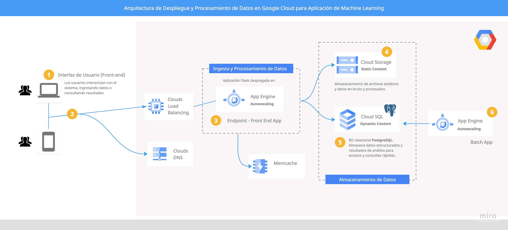

# Arquitectura y Despliegue de Aplicación Flask en Google Cloud Platform

## Introducción

En este documento, se detalla el proceso completo y las decisiones técnicas tomadas para el **desarrollo y despliegue de una [aplicación Flask](https://flask.palletsprojects.com/en/3.0.x/) en [Google Cloud Platform (GCP)](https://cloud.google.com/gcp)**. A continuación, describo la arquitectura elegida, la configuración del stack, y las pruebas realizadas para asegurar la funcionalidad y eficiencia de la aplicación.


## Arquitectura Elegida

### Justificación

Para el despliegue de esta aplicación, he optado por utilizar **Google App Engine y Cloud SQL** como los recursos principales. Inicialmente, el diagrama propuesto incluía una arquitectura más compleja con Cloud Functions y Dataproc, pero tras diversas iteraciones y pruebas, determiné que una configuración más sencilla y directa sería suficiente para satisfacer nuestras necesidades actuales.

### Diagrama de Arquitectura



1. **Interfaz de Usuario (Front-end)**: Los usuarios interactúan con el sistema a través de una interfaz web desplegada en App Engine.
2. **App Engine**: Aloja nuestra aplicación Flask, proporcionando escalabilidad automática y fácil integración con otros servicios de Google Cloud.
3. **Cloud SQL con PosgreSQL**: Almacena datos estructurados y resultados de análisis, facilitando accesos y consultas rápidas.


## Configuración del Stack

El proceso seguido se encuentra en el documento de [Configuración del Stack en GCP](./Configuracion_Stack_GCP.md). A continuación se resumen los pasos seguidos y las etapas principales:

### Configuración de Cloud SQL

Se creó una instancia de **Cloud SQL (PostgreSQL)** para almacenar los datos del usuario y los resultados de las predicciones. A continuación, se muestra el proceso de configuración:

1. **Creación de la instancia**: Se configuró una instancia de PostgreSQL en Cloud SQL.
2. **Configuración de la conexión**: Se ajustaron las reglas de firewall y se establecieron los parámetros de conexión para permitir que App Engine accediera a la base de datos.

### Ingesta y Procesamiento de Datos

Aunque inicialmente se propuso el uso de **Cloud Functions** para la ingesta de datos, decidí simplificar el flujo utilizando endpoints dentro de la aplicación Flask para recibir y procesar los datos directamente.

### Endpoint en Flask

Se crearon varios endpoints en Flask para manejar la ingesta de datos, la predicción de la edad de marcha y el riesgo de lesión. El código del endpoint se encuentra en el archivo `routes.py` dentro de la carpeta `/myapp`.

### Despliegue en App Engine

El archivo `app.yaml` está configurado para desplegar la aplicación en App Engine.

```yaml
runtime: python311
entrypoint: gunicorn -b :$PORT wsgi:app

env_variables:
  GOOGLE_CLOUD_PROJECT: "sistemas-predictivo-lesiones"
  BUCKET_NAME: "flaskapp-resources"
  CLOUD_SQL_NAME: "postgresql"
  CLOUD_SQL_USERNAME: "rocio"
  CLOUD_SQL_DATABASE_NAME: "userdb"
  CLOUD_SQL_PASSWORD: [PASSWORD]
  CLOUD_SQL_CONNECTION_NAME: "sistemas-predictivo-lesiones:europe-west1:postgresql"
  CLOUD_SQL_HOST: "34.38.196.5:5432"

automatic_scaling:
  target_cpu_utilization: 0.65
  min_instances: 1
  max_instances: 2

handlers:
- url: /static
  static_dir: myapp/static
- url: /.*
  script: auto
```


## Pruebas y Validación

### Pruebas Locales

Antes de desplegar en GCP, realicé exhaustivas pruebas locales para asegurarme de que la aplicación funcionaba correctamente. Esto incluyó:

1. **Verificación del flujo de datos**: Desde la ingesta hasta el almacenamiento y el procesamiento.
2. **Pruebas de modelos predictivos**: Para garantizar que los modelos de predicción de "edad de marcha" y riesgo de lesión funcionaban correctamente.
3. **Uso de [Postman](https://www.postman.com/):** Para realizar pruebas de las API en local, asegurando que las solicitudes y respuestas fueran correctas y que la integración con otros servicios funcionara sin problemas.

### Despliegue y Pruebas en GCP

Una vez validadas las pruebas locales, se procedió a desplegar la aplicación en GCP y se realizaron las siguientes pruebas:

1. **Despliegue inicial en App Engine**: Verificación de la correcta integración y funcionamiento de la aplicación en el entorno de producción.
2. **Pruebas de conexión a Cloud SQL**: Para asegurar que los datos se almacenaban y se recuperaban correctamente.
3. **Monitoreo y ajuste de rendimiento**: Utilizando las herramientas de monitoreo de Google Cloud para optimizar la utilización de recursos y ajustar el escalado automático.


## Retos y Soluciones

### Guardar Datos en Cloud SQL

- **Problema**: Guardar los datos en un archivo CSV en Cloud Storage resultó ser más complicado debido al tipo de archivo y al manejo de permisos.
- **Solución**: Opté por hacer la ingesta de datos en Cloud SQL, lo que resultó ser más sencillo en términos de configuración y conexión.

### Limitaciones de la Cuenta de Google Cloud

- **Problema:** Al no tener la cuenta gratuita de Google Cloud, encontré limitaciones al configurar Dataproc y tenía preocupaciones sobre posibles sobrecostos del proyecto.
- **Solución:** Decidí realizar las tareas de ETL con PySpark en local para evitar costos adicionales.

### Configuración Inicial

- **Problema**: Configurar y asegurar la correcta integración entre App Engine y Cloud SQL.
- **Solución**: Ajustes en las reglas de firewall y verificación de las credenciales y permisos adecuados.

### Gestión de Dependencias

- **Problema**: Asegurar que todas las dependencias necesarias se incluyeran y funcionaran correctamente en el entorno de App Engine.
- **Solución**: Uso de `requirements.txt` y pruebas exhaustivas locales antes del despliegue.

### Optimización del Rendimiento

- **Problema**: Asegurar que la aplicación podía manejar el tráfico esperado sin problemas de rendimiento.
- **Solución**: Configuración de escalado automático en App Engine y monitoreo continuo.


## Documentación Adicional

En la carpeta `/img` se hallan capturas de pantalla que documentan cada paso del proceso, desde la **activación de la API de Dataproc** hasta la **configuración de Cloud SQL y Cloud Storage**. Estas imágenes ofrecen una visión detallada del trabajo realizado y de los problemas técnicos encontrados y resueltos.


## Próximos Pasos

1. **Monitoreo Continuo**: Continuar monitoreando el rendimiento y la seguridad de la aplicación.
2. **Optimización**: Implementar mejoras basadas en el feedback y las métricas de uso.
3. **Documentación**: Mantener la documentación actualizada y detallada para futuros desarrollos y despliegues.


## Conclusión

En esta etapa del proyecto, se han **definido y justificado cuidadosamente la arquitectura**, se ha creado y verificado un **endpoint para la ingesta de datos**, y se ha configurado el stack necesario para el **despliegue en Google Cloud Platform**. La implementación ha implicado numerosos ciclos de pruebas y ajustes para asegurar que nuestra aplicación no solo funcione correctamente, sino que también sea escalable y eficiente.  Cada reto superado ha contribuido significativamente a mi crecimiento profesional y técnico.


