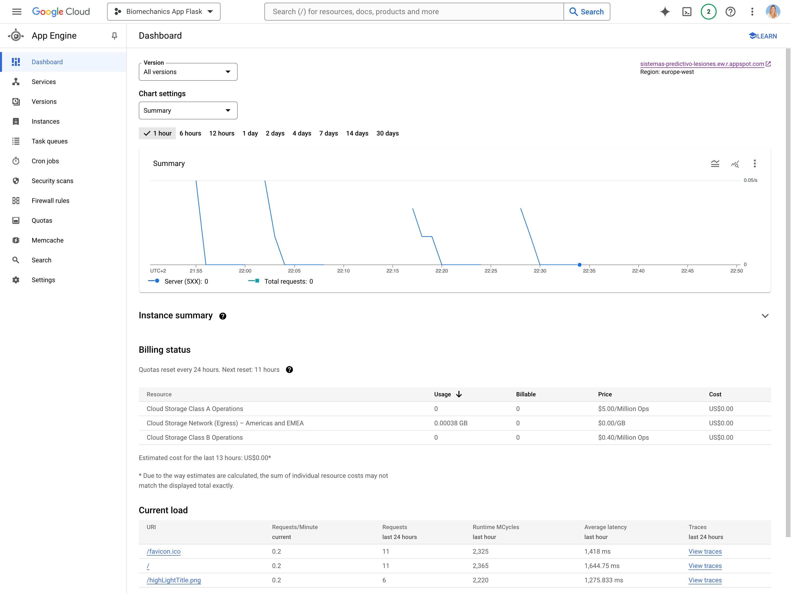
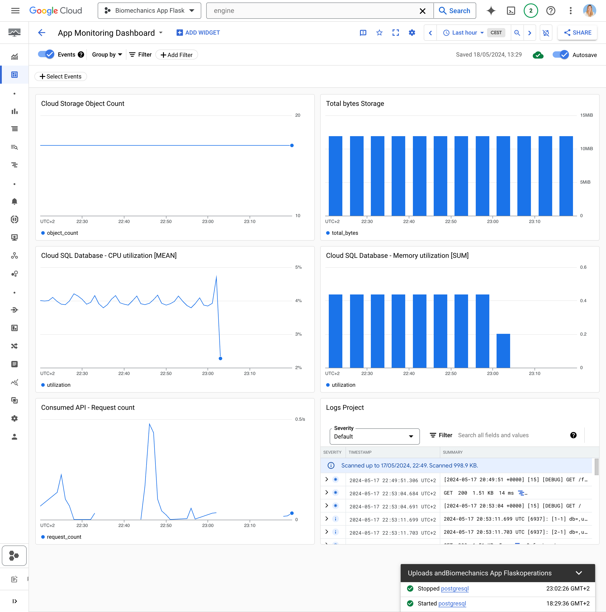
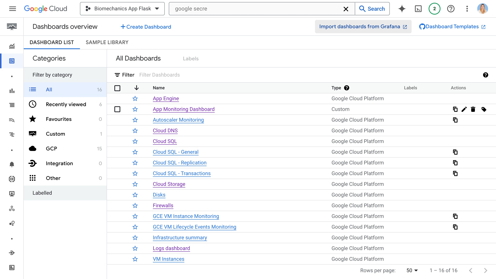

# Configuración del Stack en Google Cloud Platform

Este proyecto es una aplicación web desarrollada con **Flask** que utiliza varios servicios de **Google Cloud Platform (GCP)** para almacenamiento, procesamiento de datos y despliegue. Este README proporciona instrucciones detalladas sobre cómo configurar el stack en GCP.

## Estructura del Proyecto

### Archivos y Carpetas Principales

- **.gcloudignore**: Lista de archivos y carpetas que deben ser ignorados por Google Cloud SDK.
- **app.py**: Archivo principal de la aplicación Flask.
- **app.yaml**: Archivo de configuración para desplegar la aplicación en Google App Engine.
- **main.py**: Contiene el endpoint HTTP que se desarrolló para Cloud Functions para actualizar la base de datos con nuevos registros de datos de pacientes.
- **my_module/**: Contiene módulos para procesar datos enviados mediante solicitudes POST, asociado al archivo *main.py*.
- **requirements.txt**: Lista de dependencias del proyecto.
- **myapp/**: Carpeta que contiene todos los archivos de la aplicación, incluyendo:
    - **config.py**: Archivo de configuración
    - **routes.py**: Definiciones de rutas de la aplicación
    - **storage.py**: Funciones de almacenamiento
    - **utils.py**: Utilidades varias
    - **database.py**: Manejo de la base de datos
    - **static/**: Archivos estáticos (CSS, JS, imágenes)
    - **templates/**: Plantillas HTML.
- **google-cloud-sdk/**: Carpeta con todos los archivos del SDK de Google Cloud.
- **data/**: Carpeta con los datos originales y procesados que se suben a Cloud Storage.


## Requisitos Previos

Antes de comenzar, debemos asegurarnos de tener lo siguiente:

- Cuenta en Google Cloud Platform con facturación habilitada.
- Permisos adecuados para crear y gestionar recursos en GCP.
- Python instalado en el sistema.
- Google Cloud SDK instalado.

## Configurar Google Cloud SDK

Primero, debemos asegurarnos de tener el Google Cloud SDK instalado y configurado. Esto se realiza con el comando:

```sh
gcloud init
```


## Google Cloud Storage (GCS)

**Configuración del Bucket**: Se ha configurado un bucket en Google Cloud Storage para el almacenamiento seguro de datasets y archivos estáticos. Se aplicaron políticas de control de acceso IAM (Identity and Access Management) específicas para asegurar que únicamente usuarios con las credenciales adecuadas tengan acceso a estos recursos, fortaleciendo así la integridad y confidencialidad de los datos.


Código para **crear un bucket en GCS** para almacenamiento:

```sh
gsutil mb gs://flaskapp-resources
```


## Google Cloud Functions

**Endpoint de Recepción de Datos**: Se implementó un endpoint en Python, activado por solicitudes HTTP, diseñado para la recepción de datos desde la interfaz de usuario. Este endpoint realiza funciones críticas como la validación y procesamiento preliminar de los datos antes de su almacenamiento en Google Cloud Storage, garantizando que solo los datos validados sean persistidos.

El código utilizado como endpoint para Google Cloud Functions se encuentra en el archivo [main.py].(../../../main.py)

Código para **desplegar la función de Cloud Functions**:

```sh
gcloud functions deploy update-database --runtime python39 --trigger-http --allow-unauthenticated --entry-point app
```


## Google Cloud Dataproc

**Configuración del Clúster**: Se estableció un clúster de Dataproc para ejecutar trabajos de Apache Spark, destinados al procesamiento de los datos almacenados en Google Cloud Storage. La configuración del clúster se ha optimizado según las demandas de las cargas de trabajo, utilizando tipos de máquinas y cantidades de nodos que equilibran costos y eficiencia operativa.

Código para **configurar un clúster de Dataproc**:

```sh
gcloud dataproc clusters create my-cluster --region=YOUR_REGION --zone=YOUR_ZONE --master-machine-type=n1-standard-1 --worker-machine-type=n1-standard-1 --num-workers=2
```


## Google Cloud SQL

**Instancia de PostgreSQL**: Se configuró una instancia de base de datos PostgreSQL dentro de Google Cloud SQL para almacenar datos estructurados, incluyendo resultados y métricas derivadas del procesamiento de datos. Esta instancia está configurada para usar una dirección IP privada, reforzando la seguridad mediante el aislamiento de la red interna y está integrada con la red VPC (Virtual Private Cloud), facilitando un acceso controlado y seguro.

Código para **crear una instancia de Cloud SQL**:

```sh
gcloud sql instances create my-database-instance --tier=db-f1-micro --region=YOUR_REGION
```


## Firewall

Se configuraron reglas de firewall para controlar el tráfico entrante y saliente hacia y desde los recursos de Google Cloud. Estas reglas permiten asegurar que solo el tráfico autorizado pueda acceder a las instancias y servicios, protegiendo así los datos y aplicaciones.


## Google App Engine

**Despliegue de la Aplicación Flask**: La aplicación Flask se desplegó en Google App Engine, proporcionando una interfaz de API robusta para la ingestión de nuevos datos y la consulta de resultados procesados. Se configuró el entorno para permitir autoescalado basado en la demanda, asegurando alta disponibilidad y óptimo rendimiento. Además, se implementaron medidas de monitoreo continuo para supervisar la salud operativa de la aplicación y responder proactivamente a cualquier incidente.

Esta configuración de infraestructura en Google Cloud Platform está diseñada para garantizar un manejo eficiente, seguro y escalable de las cargas de trabajo de procesamiento de datos, satisfaciendo las necesidades del proyecto mientras se controlan los costos y se maximiza la eficiencia operativa.

Código para **desplegar la aplicación Flask en App Engine**:

```sh
gcloud app deploy
```





## Facturación (Billing)

La configuración de facturación en Google Cloud Platform es esencial para monitorizar y gestionar los costos asociados con el uso de recursos en la nube. Se configuraron alertas y presupuestos para mantener el control de los gastos y recibir notificaciones cuando se alcanzan ciertos umbrales. Esta medida permite una gestión proactiva del presupuesto y evita sorpresas en la factura.


## Monitoreo y Logging

Se configuró el monitoreo y logging utilizando **Google Cloud Logging y Monitoring** para supervisar la salud de los recursos y servicios desplegados. Esto incluye la configuración de métricas, dashboards y alertas para detectar y responder rápidamente a cualquier incidente o problema de rendimiento.





## Manejo de Secretos y Variables de Entorno

Para gestionar secretos y variables de entorno de forma segura, se utiliza **Google Secret Manager**. Esto asegura que la información sensible no se exponga en el código fuente ni en archivos de configuración.