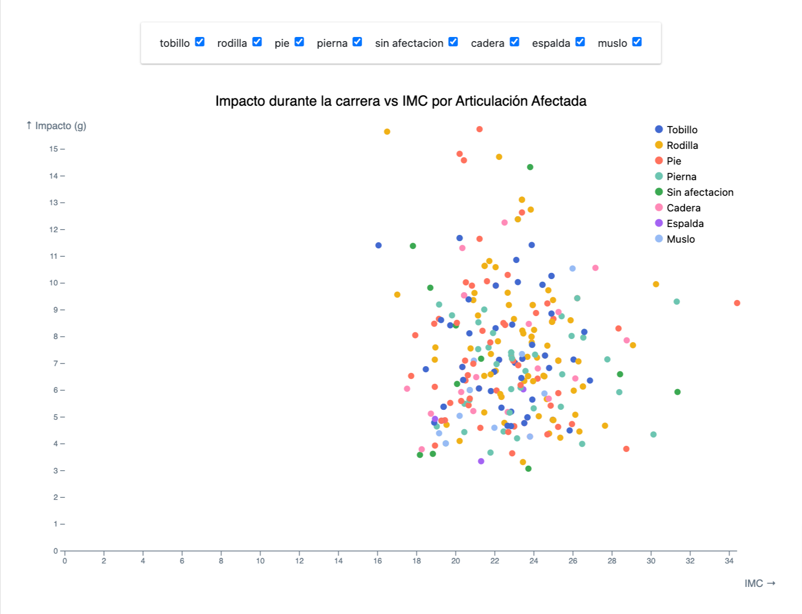
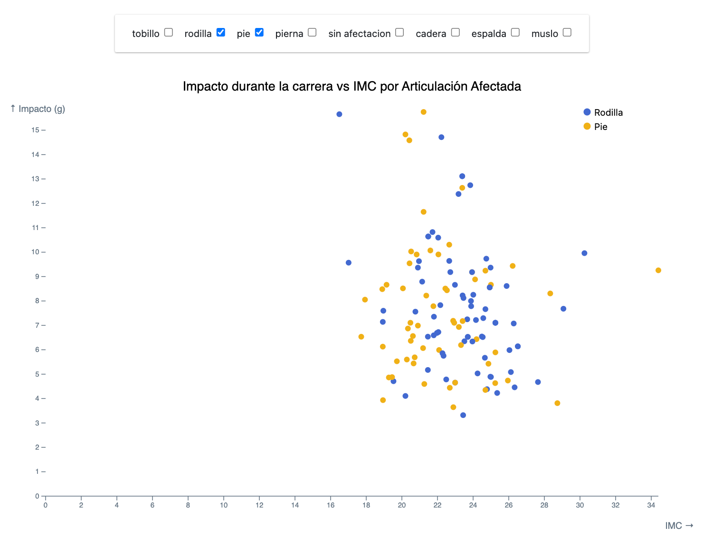

# Proyecto de Visualización de Datos de Corredores con D3.js

Esta parte del proyecto se enfoca en la **creación de visualizaciones interactivas utilizando [D3.js](https://d3js.org/)** para analizar el subconjunto de datos sobre corredores. La visualización se ha integrado dentro de una aplicación desarrollada en Flask, aprovechando las capacidades de esta tecnología para servir un template adicional y un archivo `main.js` dentro de la carpeta `/js` de `/static` del proyecto.

## Objetivos

El **objetivo principal** es exponer de manera visual y diferente la **relación que existe entre el impacto durante la carrera y el IMC (Índice de Masa Corporal), el peso y la articulación afectada**. Esto se diferencia de los análisis anteriores realizados con Tableau y otros métodos de análisis al proporcionar una representación gráfica interactiva que puede ayudar a identificar asociaciones o conclusiones de forma visual.

## Tecnologías Utilizadas

- Flask
- D3.js v7
- Google Cloud Storage
- PySpark (ETL)

## Integración en la Aplicación Flask

### Estructura del Proyecto

El proyecto está estructurado de la siguiente manera:

- `app.py`: Archivo principal de Flask que configura y ejecuta la aplicación.
- `/templates`: Carpeta que contiene los templates HTML, incluyendo el template para la visualización con D3.js.
- `/static/js/main.js`: Archivo JavaScript que contiene la lógica de D3.js para generar las visualizaciones.
- `/static/css/style.css`: Archivo CSS para estilos personalizados.
- `dataset_corredores_processed.csv`: Archivo CSV almacenado en Google Cloud Storage, que contiene los datos de los corredores.

### Flujo de Trabajo

1. **ETL con PySpark**: Los datos de los corredores fueron extraídos, transformados y cargados utilizando PySpark. Esta etapa asegura que los datos están limpios y estructurados correctamente para su análisis.
2. **Almacenamiento en Google Cloud Storage**: Los datos procesados se almacenaron en Google Cloud Storage, lo que demuestra la capacidad de interconexión entre diferentes áreas tecnológicas abordadas en el proyecto.
3. **Integración en Flask**: Se añadió un nuevo template en la aplicación Flask para mostrar la visualización, y se utilizó D3.js en el archivo `main.js` para generar los gráficos interactivos.

## Visualizaciones Implementadas

### 1. Gráfico de Dispersión (Scatter Plot)

El gráfico de dispersión muestra la relación entre el IMC y el impacto durante la carrera para diferentes articulaciones afectadas. Las características principales del gráfico incluyen:

- **Puntos de Dispersión**: Cada punto representa un corredor, codificado por color según la articulación afectada.
- **Tooltip Interactivo**: Al pasar el cursor sobre un punto, se muestra un tooltip con información detallada sobre el corredor.
- **Zoom y Pan**: Permite acercar y alejar el gráfico para explorar diferentes regiones de datos con más detalle.

### 2. Diagrama de Barras (Bar Chart)

El diagrama de barras muestra el impacto promedio y el IMC promedio por articulación afectada. Las características principales del diagrama incluyen:

- **Barras Agrupadas**: Cada grupo de barras representa una articulación, con barras individuales para el impacto promedio y el IMC promedio.
- **Tooltip Interactivo**: Al pasar el cursor sobre una barra, se muestra un tooltip con información detallada.
- **Escalas Fijas**: Los ejes Y tienen valores máximos fijos para garantizar una comparación consistente entre las articulaciones.

### 3. Controles Interactivos

Se han implementado controles interactivos para filtrar los datos y personalizar la visualización:

- **Checkboxes de Articulaciones**: Permite seleccionar o deseleccionar las articulaciones para filtrar los datos mostrados en ambas visualizaciones.
- **Rango de Peso**: Un control de rango permite ajustar el peso máximo de los corredores incluidos en la visualización, actualizando dinámicamente los gráficos.

### Diseño Minimalista

Se ha optado por un **diseño muy básico y minimalista** centrado en los colores para no saturar demasiado y acorde al estilo de la aplicación. El fondo blanco y los colores seleccionados tienen la intención de que la visualización sea fácil de interpretar y agradable a la vista. Este enfoque asegura que los usuarios puedan centrarse en los datos sin distracciones innecesarias.

## Conclusión

En esta fase del proyecto, se ha logrado integrar una visualización interactiva y dinámica dentro de una aplicación Flask, utilizando D3.js para analizar y explorar datos de corredores. Esta implementación no solo muestra la relación entre el impacto durante la carrera, el IMC y las articulaciones afectadas, sino que también destaca la interconexión entre diferentes áreas tecnológicas, desde la extracción y transformación de datos con PySpark hasta el almacenamiento en Google Cloud Storage y la visualización con D3.js.

Este trabajo demuestra un enfoque integral y multidisciplinario, aprovechando diversas tecnologías para proporcionar una herramienta de análisis visual robusta y efectiva. La visualización interactiva permite identificar asociaciones y patrones que pueden no ser evidentes en análisis estáticos, proporcionando así un valor añadido significativo al proyecto.