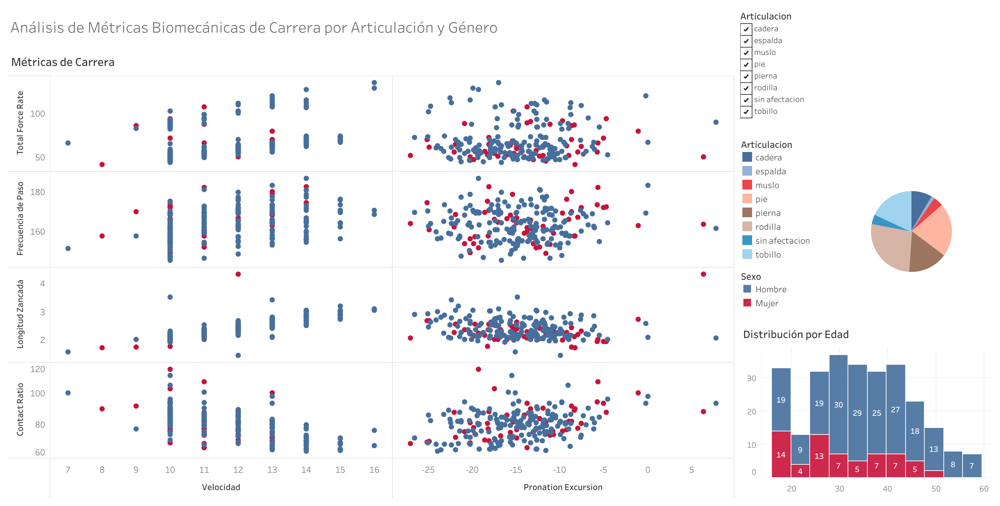

# Documentación del Dashboard de Biomecánica en Tableau 📊

Este documento técnico resume el desarrollo de un dashboard interactivo en Tableau diseñado para el análisis biomecánico basado en datos de 900 sujetos. Cubre los pasos del diseño, las visualizaciones clave y las interacciones incorporadas, así como la metodología de implementación en Tableau. El objetivo es presentar **visualizaciones que permitan a los profesionales de la salud identificar patrones y factores de riesgo de manera efectiva**.

🔗 [Enlace al Dashboard en Tableau Public](https://public.tableau.com/app/profile/rocio.benitez.garcia/viz/AnlisisdeMtricasBiomecnicasdeCarrera/Dashboard1)

## Definición de KPIs y Objetivos Analíticos 🎯

Crear un dashboard que permita a los usuarios (entrenadores, atletas, médicos) identificar patrones y posibles riesgos de lesiones durante la carrera. El dashboard se centrará en métricas clave de biomecánica y datos demográficos para proporcionar una visión integral del rendimiento y la salud del corredor.

Con el propósito de guiar la construcción del dashboard, se establecieron KPIs y objetivos analíticos que reflejan las metas del proyecto:
- Identificación de **patrones biomecánicos** asociados con **lesiones**.
- **Correlaciones** entre variables biomecánicas y eficiencia energética.
- **Predicciones de rendimiento** basadas en datos biomecánicos.
- **Clasificación** de sujetos según **riesgo de lesión**.
- Comparaciones entre distintos **niveles** de atletas.

## Preparación de los Datos

Antes de comenzar con Tableau, nos aseguramos de que los datos están limpios y estructurados correctamente. Por eso, tras una primera evaluación del dataset original en Tableau, se decidió continuar con la etapa de Análisis Exploratorio de los Datos con Python (EDA inicial) y el procesamiento de los mismos, para luego volver a Tableau y trabajar las visualizaciones con los datos limpios y trabajados, ya que los datos crudos debían manejarse primero. Esto incluye:

- **Limpiar datos nulos**: Nos aseguramos de manejar cualquier valor nulo o faltante.
- **Transformar Variables**: Nos aseguramos de que las variables estén en el formato correcto (por ejemplo, convertir categorías en variables categóricas, fechas en formato de fecha, etc.).

### Datos a utilizar
- **Demográficos**: edad, sexo, altura, peso, número de calzado.
- **Biomécanicos de marcha y carrera**: pace, velocidad, step rate, stride length, flight ratio, power, shock, impact gs, braking gs, footstrike type, pronation excursion, max pronation velocity, peak vertical grf, contact ratio, stride angle, leg spring stiffness, vertical spring stiffness, vertical grf rate, total force rate, step length, stance excursion, vertical oscillation.
- **Pruebas clínicas**: genu valgo, genu varo, genu flexum, posiciones de rótulas, etc.

                                                      
## Proceso de Análisis y Visualización 📈

### Análisis Descriptivo Inicial

El análisis estadístico descriptivo se abordó inicialmente en Tableau para obtener una visión general de la distribución, la tendencia central y la variabilidad de cada variable, facilitando así una rápida **detección de outliers**. Para un examen más exhaustivo y detallado, se complementó este proceso con un **análisis avanzado** utilizando **Python** en un cuaderno de Jupyter Notebook. Los hallazgos y metodologías detalladas se documentan en el archivo [EDA-jupyter-notebook.md](./EDA-jupyter-notebook.md).

### Análisis de Correlación

Utilizando Tableau, se crearon mapas de calor para explorar correlaciones entre las distintas variables, identificando relaciones potenciales significativas.

### Visualizaciones de Datos

Se diseñaron gráficos de dispersión y mapas de calor en Tableau para examinar detalladamente la relación entre las variables, facilitando la identificación de patrones y tendencias.

### Contexto Biomecánico

Cada métrica se analizó considerando su relevancia clínica y significado dentro del contexto biomecánico y la historia clínica, con interpretaciones respaldadas por expertos.

## Diseño del Dashboard

### Resumen Ejecutivo

El dashboard incluye un panel de KPIs claves como número de sujetos en riesgo, promedios de variables de rendimiento y alertas rápidas para outliers críticos.

### Distribución y Segmentación

Los histogramas y gráficos de densidad de variables biomecánicas permiten la segmentación por demografía, brindando una visión integral de la población estudiada.

### Comparativas y Relaciones

A través de visualizaciones interactivas, se representan las correlaciones entre variables biomecánicas y de rendimiento para establecer patrones de predicción.

### Detalles Individuales y Predicciones

Se ofrece una vista detallada de las métricas de cada sujeto, y se visualizan proyecciones de variables clave basadas en modelos predictivos.

## Implementación en Tableau

La preparación de datos se completó satisfactoriamente, y se diseñaron y ajustaron visualizaciones interactivas siguiendo una metodología iterativa.

### Construcción de Visualizaciones

Se desarrollaron histogramas, boxplots, mapas de calor y gráficos de dispersión utilizando funcionalidades de Tableau para cada tipo de gráfico mencionado.

### Interactividad y Ajustes

Filtros y controles interactivos fueron incorporados para permitir la exploración de datos, con ajustes continuos basados en la retroalimentación de los usuarios y expertos.

## Compartir el Dashboard en Tableau Public

## Conclusiones y Pasos Futuros

La construcción del dashboard es un esfuerzo colaborativo continuo que facilita la interpretación efectiva de los datos biomecánicos, con vistas a su aplicación en entornos clínicos y deportivos.

## Enlaces de interés 🔗

- [Biblioteca de aprendizaje Tableau](https://help.tableau.com/current/guides/get-started-tutorial/es-es/get-started-tutorial-next.htm)
- [Crear tipos de gráficos comunes en las vistas de datos](https://help.tableau.com/current/pro/desktop/es-es/dataview_examples.htm)