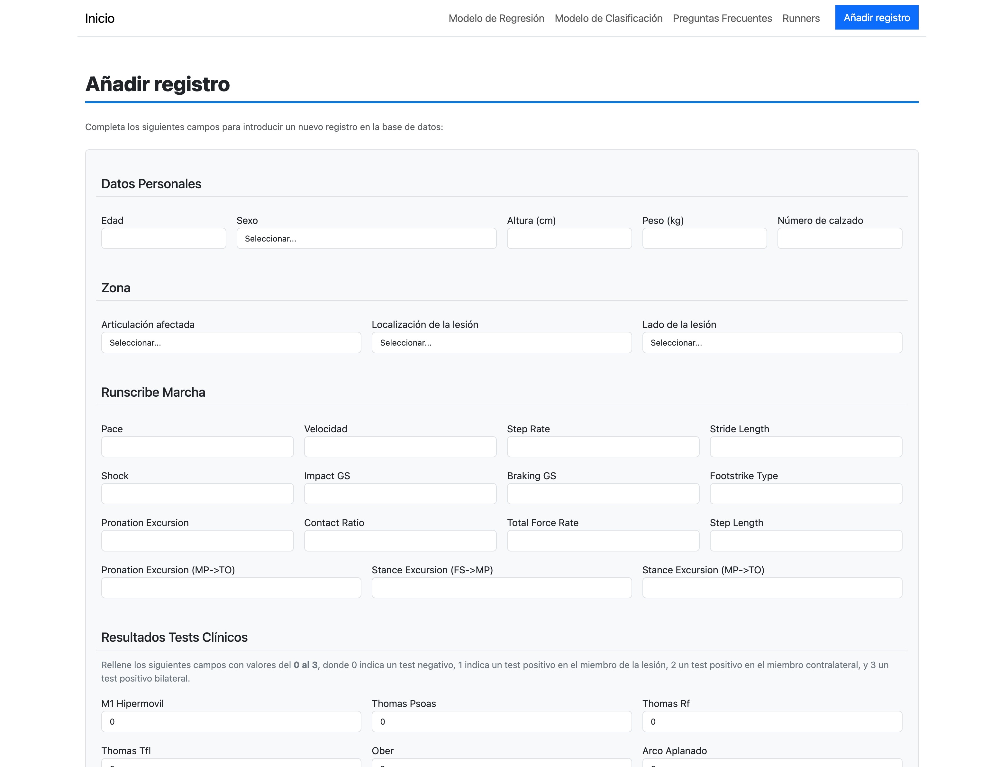
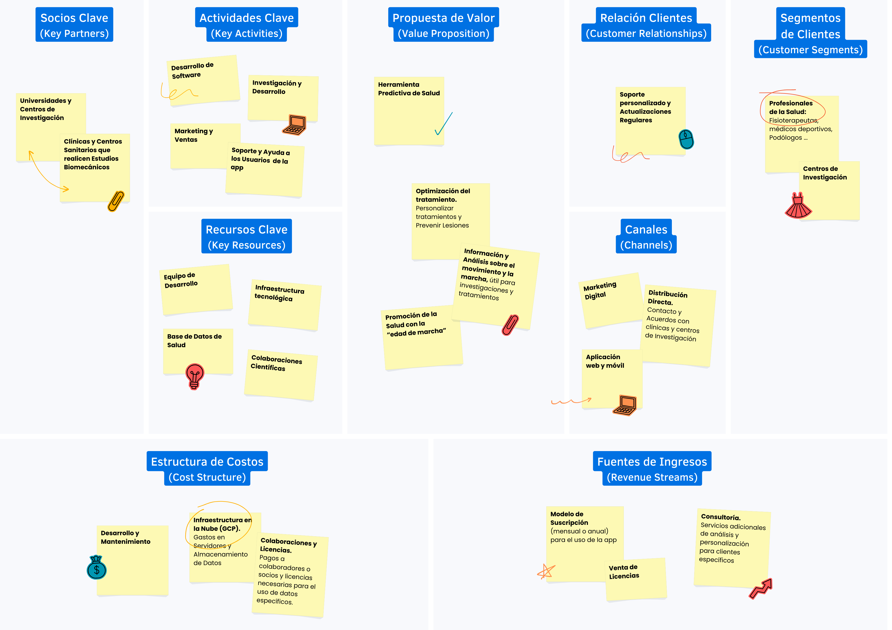

# Proyecto Final del Bootcamp de Big Data y Machine Learning

Se finaliza este proyecto con una aplicación que integra dos modelos predictivos, desplegada en el ecosistema de Google Cloud Platform. La aplicación utiliza datos de salud y métricas de movimiento para predecir el riesgo de lesión en base a parámetros relevantes.

## Contenido

- Las imágenes de la aplicación final se encuentran en la carpeta `img` de este Sprint.
- Puedes ver el video de presentación [aquí](https://drive.google.com/file/d/1ZLthCohnbCmL4Laq5dt2YS-dJHR4tkAo/view?usp=sharing).
- El enlace para acceder a la aplicación está disponible en el repositorio de GitHub.

## Business Model Canvas

### 1. Socios Clave (Key Partners)

- **Universidades y centros de investigación:** Colaboración en la validación y mejora de los modelos.
- **Proveedores de tecnología:** Empresas que proporcionan infraestructura en la nube y herramientas de desarrollo.
- **Asociaciones médicas:** Organizaciones que puedan promover la aplicación entre profesionales de la salud.
- **Expertos en biomecánica:** Consultores que aporten conocimientos especializados para el desarrollo y validación de los modelos.

### 2. Actividades Clave (Key Activities)

- **Desarrollo de software:** Creación y mantenimiento de la aplicación y modelos predictivos.
- **Investigación y desarrollo:** Innovación constante para mejorar la precisión y funcionalidad de los modelos.
- **Marketing y ventas:** Promoción de la aplicación y gestión de relaciones con clientes y socios.
- **Soporte y capacitación:** Ayuda a los usuarios y formación para el uso efectivo de la aplicación.

### 3. Recursos Clave (Key Resources)

- **Equipo de desarrollo:** Desarrolladores y científicos de datos que mantengan y mejoren la aplicación.
- **Infraestructura tecnológica:** Servidores y servicios en la nube para el almacenamiento y procesamiento de datos.
- **Base de datos de salud:** Acceso a datos clínicos y biomecánicos para mejorar los modelos predictivos.
- **Colaboraciones científicas:** Asociaciones con instituciones de investigación para validar y mejorar la aplicación.

### 4. Propuesta de Valor (Value Proposition)

- **Herramienta predictiva de salud:** Una aplicación que predice el riesgo de lesiones basándose en parámetros biomecánicos y clínicos.
- **Optimización del tratamiento:** Ayuda a los profesionales de la salud a personalizar tratamientos y prevenir lesiones.
- **Análisis avanzado de movimiento:** Proveer información detallada sobre el movimiento y la marcha, útil para investigaciones y tratamientos.

### 5. Relaciones con los Clientes (Customer Relationships)

- **Soporte personalizado:** Atención al cliente para resolver dudas y problemas técnicos.
- **Capacitación:** Tutoriales y seminarios web para enseñar el uso de la aplicación.
- **Actualizaciones regulares:** Mejoras continuas en la aplicación basadas en feedback de los usuarios.

### 6. Canales (Channels)

- **Aplicación web:** Plataforma accesible a través de navegadores.
- **Aplicación móvil:** Acceso desde dispositivos móviles para mayor conveniencia.
- **Distribución directa:** Contacto y acuerdos con clínicas, hospitales y centros de investigación.
- **Marketing digital:** Uso de redes sociales, blogs y otros medios digitales para promover la aplicación.

### 7. Segmentos de Clientes (Customer Segments)

- **Clínicas y hospitales:** Instituciones que deseen mejorar sus servicios de diagnóstico y prevención de lesiones.
- **Centros de investigación:** Equipos que trabajan en estudios biomecánicos y necesitan herramientas avanzadas de análisis.
- **Profesionales de la salud:** Fisioterapeutas, médicos deportivos y otros especialistas que trabajen en la prevención y tratamiento de lesiones.

### 8. Estructura de Costos (Cost Structure)

- **Desarrollo y mantenimiento:** Costos asociados al desarrollo y mejora continua de la aplicación.
- **Infraestructura en la nube:** Gastos en servidores y almacenamiento de datos.
- **Marketing y ventas:** Inversión en campañas publicitarias y actividades de ventas.
- **Soporte y capacitación:** Recursos destinados a la atención al cliente y formación de usuarios.
- **Colaboraciones y licencias:** Pagos a socios y licencias necesarias para el uso de tecnologías y datos específicos.

### 9. Fuentes de Ingresos (Revenue Streams)

- **Suscripciones:** Modelo de suscripción mensual o anual para el uso de la aplicación.
- **Licencias:** Venta de licencias a grandes instituciones como hospitales y centros de investigación.
- **Consultoría:** Servicios adicionales de análisis y personalización para clientes específicos.

## Experiencia

Ha sido una experiencia increíble trabajar en este proyecto. He disfrutado mucho aplicando mis conocimientos en Big Data y Machine Learning en un proyecto práctico y relevante. Me gustaría seguir trabajando en esta área y explorar nuevas oportunidades.

